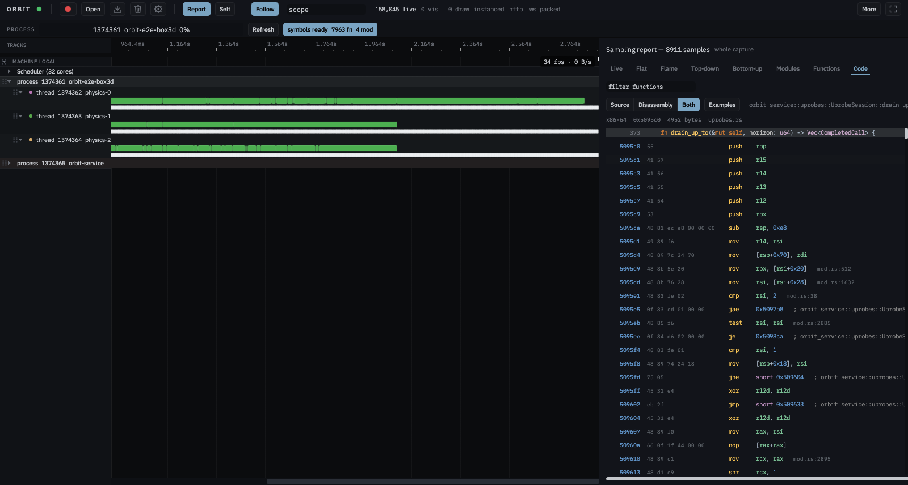
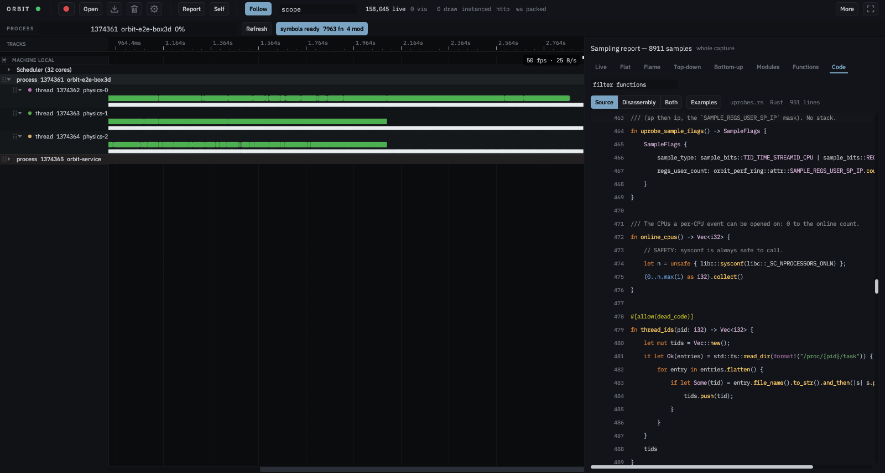
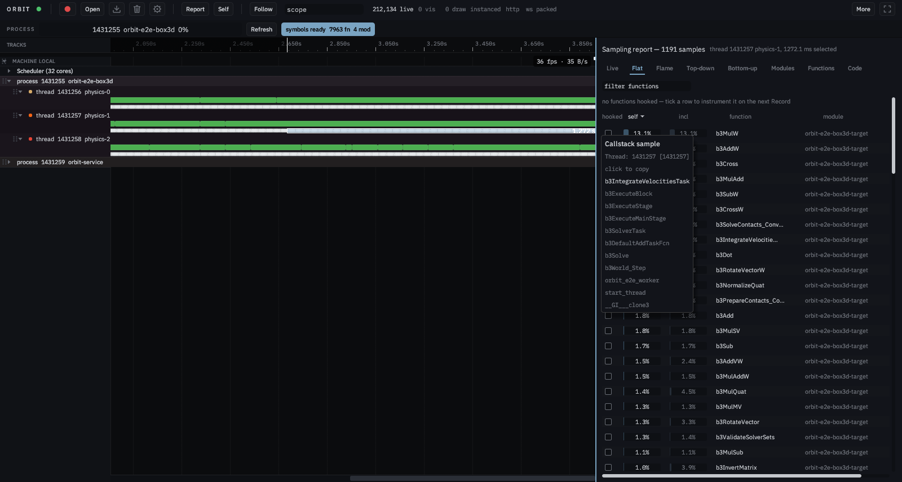
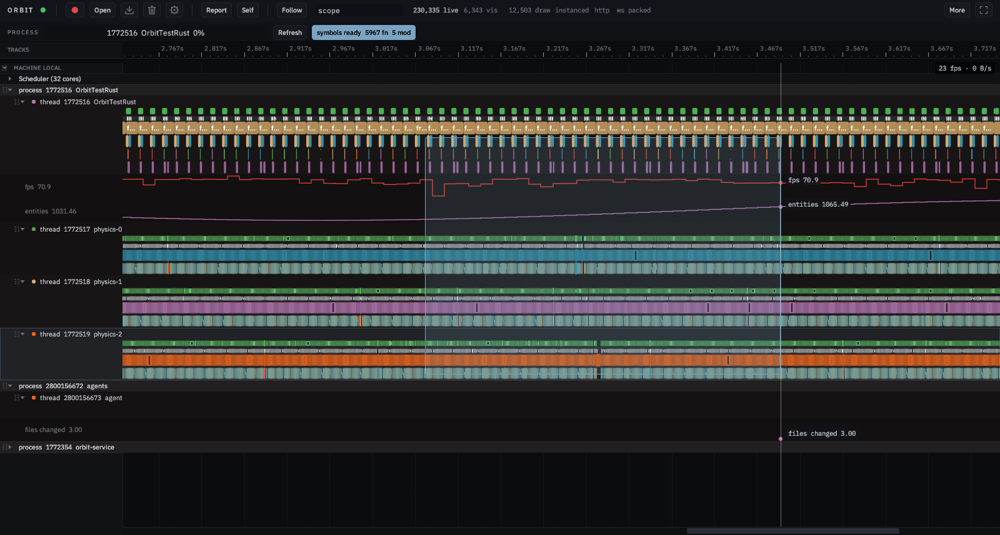
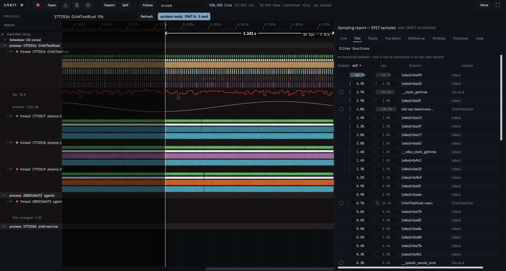
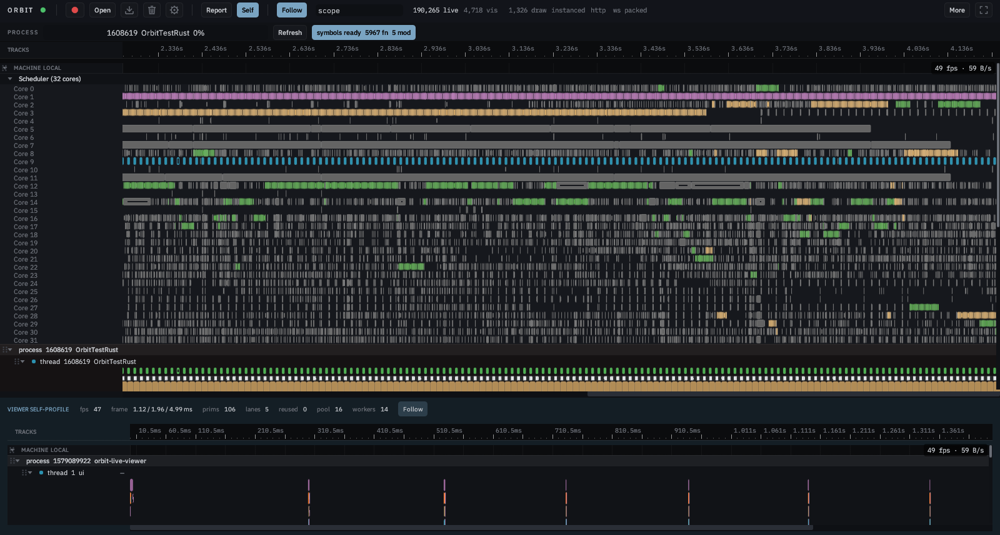
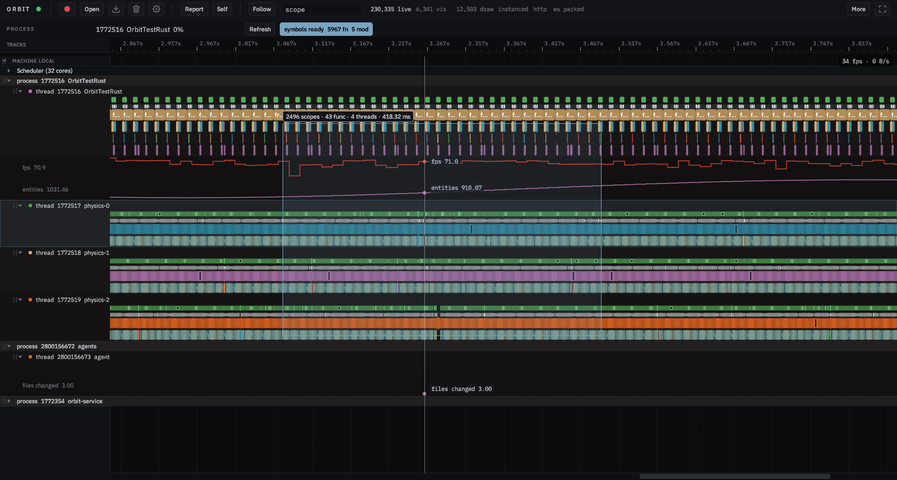
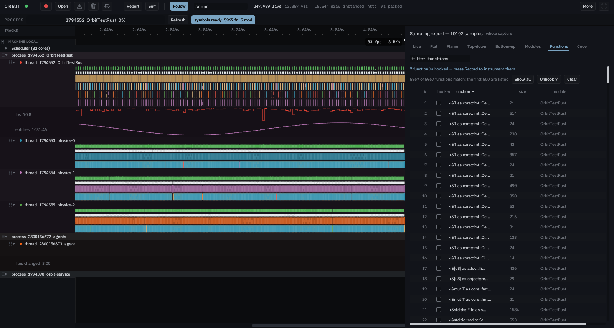

# Orbit e2e report

Run 2026-09-07 15:33 at commit `13cbd0128` on `rixbox`.

| Scenario | Result | Time | Note |
|---|---|---|---|
| python-reader | pass | 6.4s | 252914 events; 3 agent rows, 1016 value rows; startup scopes present; service threads named ['orbit-capture', 'orbit-http', 'orbit-service', 'tokio-rt-worker'] |

## Numbers

(no numbers: the perf scenario did not run)

## Screenshots

- `01-viewer-idle.png` -- 
- `02-capture-live.png` -- 
- `03-report-flat.png` -- 
- `04-report-topdown.png` -- 
- `05-report-bottomup.png` -- 
- `06-report-modules.png` -- 
- `07-api-rust.png` -- 
- `08-api-c.png` -- 
- `09-api-cpp.png` -- 
- `10-api-python.png` -- 
- `11-self-instrumentation.png` -- 
- `12-thread-focus.png` -- 
- `13-scope-menu.png` -- 
- `14-scope-report.png` -- 
- `15-live-tab.png` -- 
- `16-flame-tab.png` -- 
- `17-opened-slice.png` -- 
- `18-agent-track.png` -- 
- `19-service-lanes.png` -- 
- `20-cleared.png` -- 
- `21-self-pane.png` -- 
- `22-website.png` -- 
- `23-static-viewer.png` -- 
- `24-hook-from-report.png` -- 
- `25-report-filter.png` -- 
- `26-code-both.png` -- 
- `27-code-source.png` -- 
- `30-sample-bar-select.png` -- 
- `31-rect-select.png` -- 
- `32-time-measure.png` -- 
- `33-self-pane.png` -- 
- `34-measure-scrolled.png` -- 
- `35-rect-panned.png` -- 
- `36-batch-hook.png` -- 
