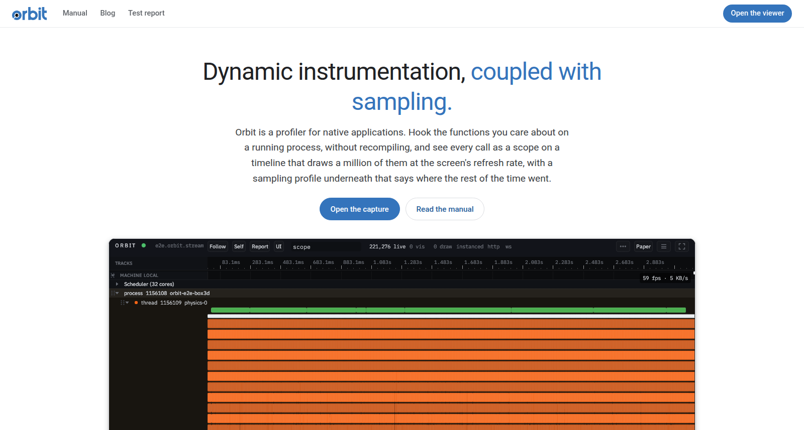
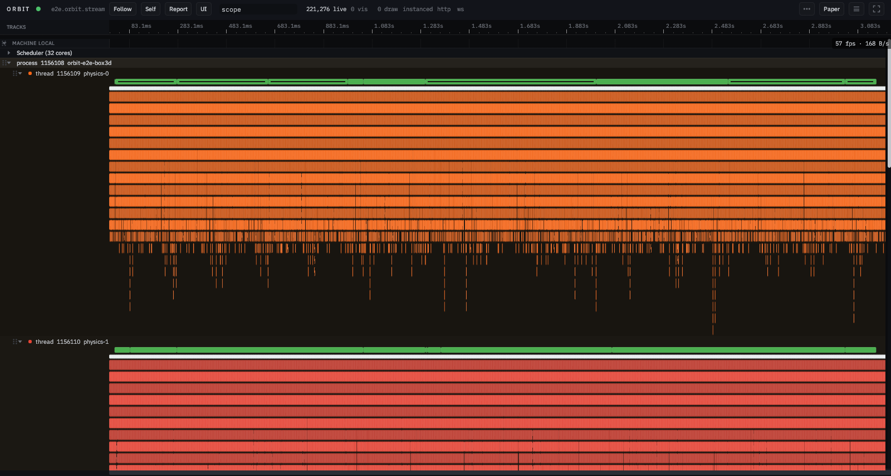
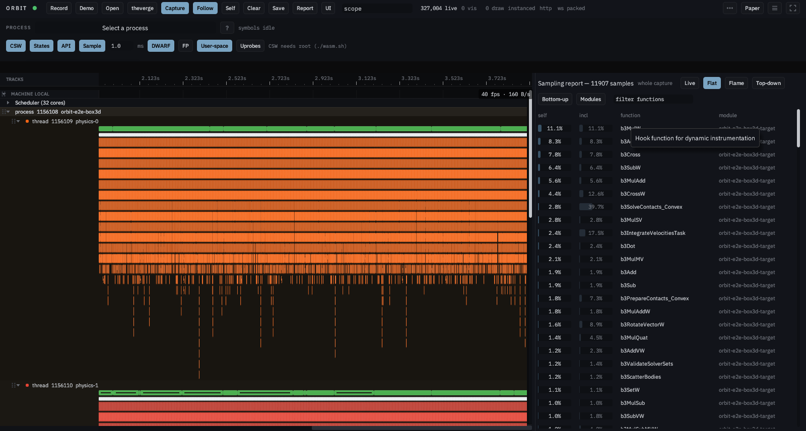
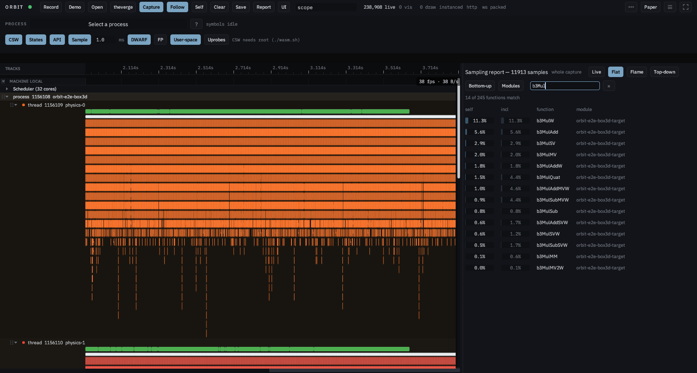

# Orbit e2e report

Run 2026-09-04 20:34 at commit `738959c68` on `rixbox`.

| Scenario | Result | Time | Note |
|---|---|---|---|
| viewer-idle | pass | 9.6s |  |
| processes | pass | 0.0s |  |
| symbols | pass | 0.4s |  |
| function-search | pass | 0.0s |  |
| capture-scheduling | pass | 20.4s |  |
| sampling-report | pass | 9.1s |  |
| call-trees | pass | 9.1s |  |
| selection-report | pass | 9.2s |  |
| report-tabs | pass | 61.2s |  |
| api-rust | pass | 19.1s | 226542 events, 154 links, 2005 pre-start refused |
| api-c | pass | 19.0s | 226007 events, 154 links, 1033 pre-start refused |
| api-cpp | pass | 19.1s | 226402 events, 154 links, 1783 pre-start refused |
| api-python | pass | 18.9s | 114239 events, 112 links, 952 pre-start refused |
| self-instrumentation | pass | 18.1s | 2 segment(s), 218916 events, 145 links (not drawn yet) |
| thread-states | pass | 7.1s | skipped: no scheduling tracepoints (needs CAP_PERFMON) |
| instrumentation | pass | 6.1s | skipped: no hooks armed: uprobes need CAP_PERFMON |
| thread-focus | pass | 20.5s | thread 1157535 of pid 1157535 |
| scope-report | pass | 30.3s | 'update': 905 samples over 301 instances |
| live-tab | pass | 11.1s | 300 rows, histogram for 'solve contacts' |
| flame-tab | pass | 11.2s | ok |
| save-slice-open | pass | 10.7s | 2235 KB bundle, 234 KB slice, 19717 events reopened |
| python-reader | pass | 1.2s | 209677 events; 3 agent rows, 1011 value rows |
| agent-scopes | pass | 18.8s | tracks ['agent'] |
| service-lanes | pass | 9.5s | 1 value lane(s) under pid 1156112 |
| clear | pass | 10.0s | ok |
| wire-and-perf | pass | 24.4s | wire packed, 512 KB/s on the socket |
| website | pass | 21.4s | 221276 events from a 2633 KB stream, 6.8 s to first events |
| hook-from-report | pass | 30.8s | hooked 'b3MulW'; arming skipped: no hooks armed: uprobes need CAP_PERFMON |
| report-filter | pass | 21.8s | 14 of 200 rows match 'b3Mul' |

## Numbers

- wire: packed
- events: 221276
- ws_bps_during_capture: 524057
- bundle_bytes: 2289341
- slice_bytes: 239851
- stream_bytes: 2697103
- site_first_events_s: 6.8
- service status: {"events_live": 221276, "events_capacity": 8388608, "ring_bytes": 268435456, "produced": 221276, "dropped": 0}

Viewer self-profile (headless Chrome, SwiftShader: slower than a GPU):

| Phase | Total ms | Count | Avg us | Max us |
|---|---|---|---|---|
| Frame | 2.96 | 1 | 2965.0 | 2965.0 |
| TimelinePayload | 2.15 | 1 | 2150.0 | 2150.0 |
| PrimitiveListing | 0.85 | 1 | 855.0 | 855.0 |
| PoolDispatch | 0.6 | 1 | 605.0 | 605.0 |
| Net | 0.21 | 1 | 210.0 | 210.0 |
| DrainNet | 0.2 | 1 | 205.0 | 205.0 |
| ListingFlatten | 0.14 | 1 | 140.0 | 140.0 |
| Chrome | 0.14 | 1 | 135.0 | 135.0 |
| ClipLabels | 0.1 | 1 | 105.0 | 105.0 |
| ChooseLod | 0.07 | 1 | 70.0 | 70.0 |
| ScalePpp | 0.07 | 1 | 65.0 | 65.0 |
| ApplyHighlights | 0.06 | 1 | 55.0 | 55.0 |
| Tracks | 0.04 | 1 | 45.0 | 45.0 |
| Scheduler | 0.03 | 1 | 30.0 | 30.0 |
| PaintHeaders | 0.03 | 1 | 25.0 | 25.0 |
| PaintCallback | 0.01 | 1 | 5.0 | 5.0 |
| ListingSort | 0.01 | 1 | 5.0 | 5.0 |
| HandleInput | 0.0 | 1 | 0.0 | 0.0 |
| TickFollow | 0.0 | 1 | 0.0 | 0.0 |

## Screenshots

- `01-viewer-idle.png` -- 
- `02-capture-live.png` -- 
- `03-report-flat.png` -- 
- `04-report-topdown.png` -- 
- `05-report-bottomup.png` -- 
- `06-report-modules.png` -- 
- `07-api-rust.png` -- 
- `08-api-c.png` -- 
- `09-api-cpp.png` -- 
- `10-api-python.png` -- 
- `11-self-instrumentation.png` -- 
- `12-thread-focus.png` -- 
- `13-scope-menu.png` -- 
- `14-scope-report.png` -- 
- `15-live-tab.png` -- 
- `16-flame-tab.png` -- 
- `17-opened-slice.png` -- 
- `18-agent-track.png` -- 
- `19-service-lanes.png` -- 
- `20-cleared.png` -- 
- `21-self-pane.png` -- 
- `22-website.png` -- 
- `23-static-viewer.png` -- 
- `24-hook-from-report.png` -- 
- `25-report-filter.png` -- 
