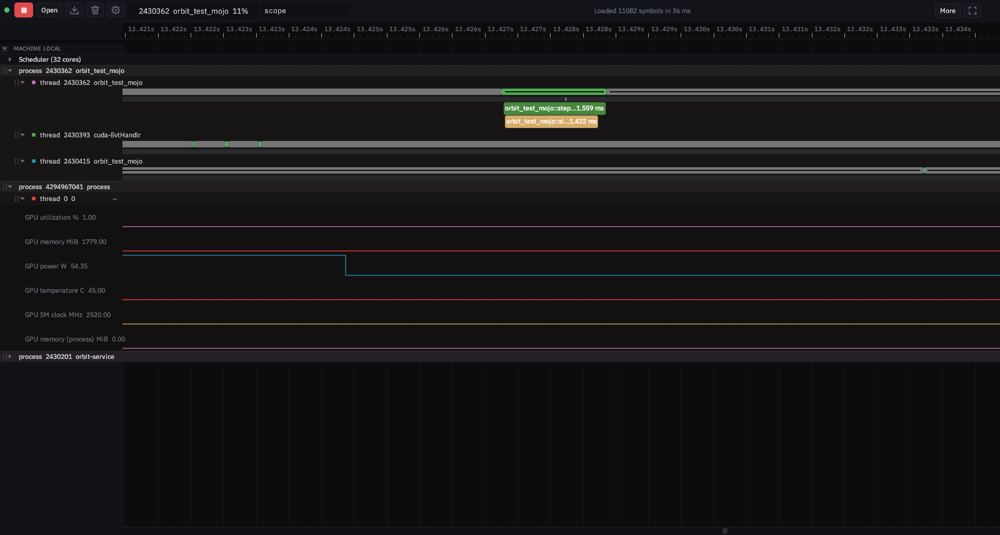

# Mojo: host and GPU in one timeline

The same "one timeline across the boundary" angle as
[Python](python-ebpf-instrumentation.md), but Mojo makes it **simpler**, not
harder — and the GPU side is a natural fit. Built and proven on a real Mojo
1.0.0 program on an RTX 4090; the measured facts are below.



## Why Mojo is the easy case

Python needed CPython's USDT probes because it is *interpreted*: the functions
Orbit wants to see are bytecode inside the interpreter, invisible from outside
without a probe mechanism (and, for in-kernel filtering, eBPF).

**Mojo compiles ahead of time** (through MLIR/LLVM) to native code. A Mojo
function is an ordinary native symbol in the binary. So Orbit needs no new
probe mechanism — its **existing native dynamic instrumentation** (kernel
uprobes, or the Frida engine) hooks a Mojo function exactly the way it hooks a
C, C++ or Rust function: pick it, entry and exit become a scope on the calling
thread, no rebuild of the target. The sampling profiler already unwinds and
symbolizes native frames, so Mojo frames appear in the flame graph and trees.

What is Mojo-specific turned out to be exactly one thing: **the names**.

## What a Mojo binary looks like (measured, Mojo 1.0.0 `ed45d567`)

Read off `src/OrbitTestMojo/orbit_test_mojo`, built with `mojo build -g`:

- **Mojo does not mangle.** `.symtab` holds the source path with every type
  spelled out, as a *local* symbol (`t`) — not in `.dynsym`:
  ```
  orbit_test_mojo::simulate(::SIMD[::DType(int), ::SIMDLength(1)])
  orbit_test_mojo::step(max::gpu::host::device_context::DeviceContext,
      max::gpu::host::device_context::DeviceBuffer[::DType(float32)],…,
      ::SIMD[::DType(int), ::SIMDLength(1)])
  host::Physics::integrate(host::Physics,::SIMD[::DType(float64), ::SIMDLength(1)])
  ```
  A generic instantiation carries its parameter bindings after a comma
  (`…),dtype=index,length=1,…`); the runtime wraps `main` in
  `std::builtin::_startup::__wrap_and_execute_[raising_]main[…]…_closure_N`.
  `-g` emits DWARF (`.debug_info`), so source lines are there too.
- **`@no_inline` matters.** Small Mojo functions inline away; the test program
  marks the ones it hooks.
- **A GPU kernel is not a host symbol.** It is compiled to PTX for the device
  (`nvptx64-nvidia-cuda`, `sm_89` on the 4090) and embedded as data; the host
  side has a `max::…::DeviceFunction::dump_rep[…]` instantiation whose name
  carries the kernel's full signature and its target triple/arch. So the
  kernel can be *listed* from the ELF, but a uprobe cannot land on it — it
  runs when the host launches it through the CUDA driver, which is where
  Orbit's GPU telemetry helper sees it.
- **GPU host API lives in the `max` package**, not in `mojo`
  (`from max.gpu.host import DeviceContext`); `std.gpu` has the thread/block
  ids. `mojo` alone builds host-only programs.

## Built (this PR)

- **`mojo.rs`** — Mojo name handling, pinned by fixtures copied from `nm`:
  - `is_mojo_symbol` tells a Mojo symbol from C/C++/Rust (its type spelling,
    or a literal `path::name(...)` — mangled symbols never carry `::`).
  - `pretty` shortens a name to how source spells it:
    `orbit_test_mojo::step(DeviceContext, DeviceBuffer[DType.float32],
    DeviceBuffer[DType.float32], Int)`, `host::Physics::integrate(Physics,
    Float64)`. Scalar `SIMD`s become their aliases (`Int`, `Float32`, …),
    wider ones `SIMD[DType.x, n]`; argument types keep their last path
    component; parameter blocks and instantiation bindings go; `_closure_N`
    stays.
  - `gpu_kernels` reads the kernels and their `triple`/`arch` out of the
    launch stubs.
- **Wired into the product:** the function index (`functions.rs`) and the
  sampled-frame symbolizer (`symbolize.rs`) prettify Mojo names, so the
  Functions view, search, hooks and the flame graph all read as Mojo source.
  `/api/functions/search` hits carry `"language": "mojo"`.
- **`orbit-service --mojo-functions <pid|path> [--json]`** — discovery from
  the executable alone (a pid resolves to `/proc/<pid>/exe`), the analog of
  the Python `--python-probes`: says whether it is a Mojo binary (the runtime
  entry point is present), lists the program's own functions with their
  probe file offsets, the std/max count, and the GPU kernels with their
  target. Exit 0 = Mojo, 1 = not, 2 = unreadable.
- **`src/OrbitTestMojo`** — the test program: `step` does host work
  (`simulate`) then launches `saxpy_kernel` on the GPU each frame,
  ~100 frames/s; `--cpu` runs the same host loop without a device so the
  test runs on a box with no GPU. `build.sh` builds it (needs `max`).

## Proven

- **Unit tests** (`mojo.rs`, 8): classification, every prettifying rule, the
  kernel read-out, the listing; plus one against the **real binary** when it
  is built (`the_real_mojo_binary_lists_its_functions_and_its_kernel`): three
  user functions with probe offsets, one `sm_89` kernel, and the service's own
  binary is *not* Mojo.
- **e2e `mojo`** (`tools/e2e/orbit_e2e.py`, privileged, on the RTX 4090):
  launches the program → `--mojo-functions <pid>` lists `simulate(Int)` and
  the `saxpy_kernel` for `nvptx64-nvidia-cuda` without touching the process →
  the function index serves the same names tagged `mojo` → uprobes armed on
  `simulate` and `step` (`instrumenting 2 of 2 functions`) → the exported
  bundle holds **1651 `orbit_test_mojo::simulate(Int)` + 1652 `step(…)`
  scopes** from a 6 s capture → screenshot `45-mojo-host-gpu.png`: the
  Mojo thread's scopes, its `cuda-EvtHandlr` thread, and the GPU lanes
  (utilization, memory, power, SM clock) from the telemetry helper on the same
  timeline. Skips cleanly with no Mojo toolchain, no GPU (`--cpu`), or
  unprivileged.

## Not done, stated plainly

- **Kernel spans by name.** The GPU lanes are NVML telemetry (utilization,
  power…), not per-kernel spans; a `saxpy` launch of 1 M floats is far below
  NVML's 100 ms poll, so the utilization lane does not track individual
  frames. Per-kernel spans aligned under the host `step` scope are CUPTI
  activity records through the helper — the same open item as the AI
  umbrella's CUDA profiling. The kernel *names* are already known from the
  ELF, so the attribution is a join, not a discovery problem.
- **Viewer chip.** `language: mojo` is on the wire; the Functions pane does
  not draw it yet.
- **Frida path.** Verified with kernel uprobes; the Frida engine hooks by the
  same file offsets and was not separately run against Mojo.
- **Source lines from DWARF** are emitted but not yet surfaced for Mojo
  frames (the same gap as for other native code).

## Fallbacks

- Stripped Mojo binary: sampling still works; frames are unnamed
  (`--mojo-functions` reports "not a Mojo binary" since the entry point is
  gone with the symbols).
- No GPU or no helper: the host side is unaffected; the GPU lanes are simply
  absent, as for any capture without the helper.

## Notes

- Complements the AI umbrella (PyTorch / TensorFlow / CUDA) and the Python
  angle rather than replacing them.
- Toolchain used: `uv pip install max` (Mojo 1.0.0 + MAX GPU library);
  `mojo build -g`. `from std.time import …`, `def` only (`fn` is gone in
  1.0), kernel scalars must be fixed-width (`Int32`, not `Int`).
